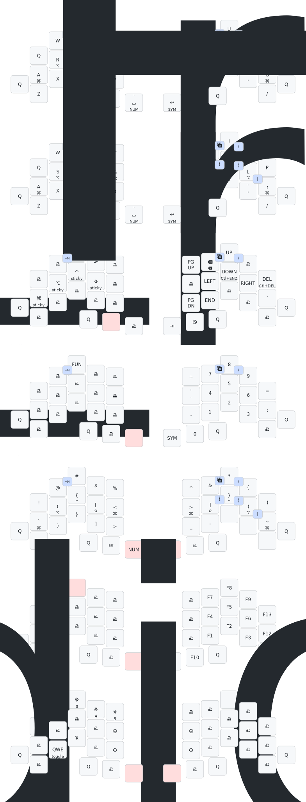

# ZMK-Config

This repository tracks my keyboard configuration.

**Note:** All changes and configurations for Kinesis Advantage 2 with
Blackpill, Urchin, Corne, and Keychron Q8 Pro have been moved to
the `legacy` branch [🔗](https://github.com/dhruvinsh/zmk-config/tree/legacy)

## Selene aka Totem

38-key keyboard with a split design and a thumb cluster.

- 2x Seeed Studio Seeeduino XIAO
- 2x 140 mAh 501522 Polymer Lithium ion Battery
- 38x [Sunset Tactile Choc Switches](https://lowprokb.ca/collections/switches/products/sunset-tactile-choc-switches)
- 38x DDC Choc PBT Blank Keycaps
- 1x [Prospector Dongle](https://github.com/carrefinho/prospector)

## Themis aka Totem

38-key keyboard with a split design and a thumb cluster.

- 2x Seeed Studio Seeeduino XIAO
- 2x 140 mAh 501522 Polymer Lithium ion Battery
- 38x [Ambients Silent Choc Switches](https://lowprokb.ca/collections/switches/products/ambients-silent-choc-switches)
- 38x KLP Lamé Saddle keycaps

## Keymap

This awesome keymap is created via [keymap-drawer](https://github.com/caksoylar/keymap-drawer).

